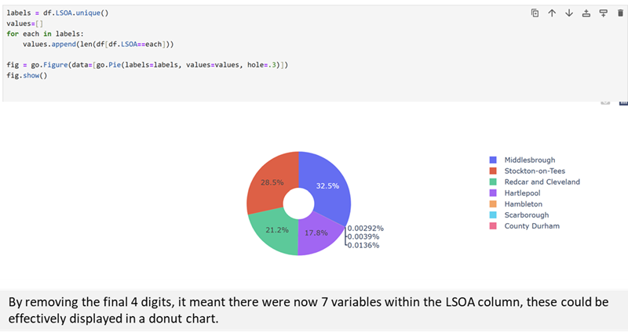
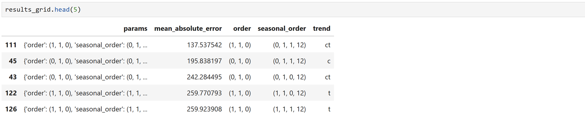
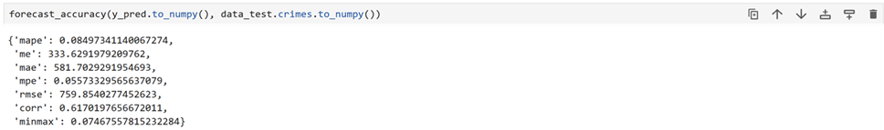

# Data Science Project – Time Series Analysis on Cleveland Police Crime Data: March 2022 to February 2025 

## Executive Summary 
This project is analysis and exploration of Cleveland Police crime data from January 2024 to February 2025, before moving onto time series analysis of a larger data set, March 2022 to February 2025. The purpose of the project was to determine if time series analysis could be used to predict the volume of future crimes committed. This will assist with helping Retail organisations make decisions about Security resourcing and investment in training relating to managing threats and retail crime. This report details the EDA process completed in Python and further analysis completed, the process of completing time series analysis and the successful outcome of the data training & testing. The project was determined to be successful after completing the augmented Dickey-Fuller test and determining that the null hypothesis could be rejected. 

## Source
The data used for this project was sourced from Police.uk/data. A site for open data about crime and policing in England, Wales, and Northern Ireland. This data set was selected as it provides street-level crime in a clear and simple CSV format. The data is sorted by police force and neighborhood teams and classifies the type of crime. There is an explanation present on the website that outlines the consultation process and governance of the data to ‘create an anonymisation process which adequately minimises privacy risks whilst still meeting our transparency goals and being useful to the public’ (About data.police.uk, no date). This makes it suitable for exploration of crime probability. 

## Loading and Initial Exploration 
The data exploration and cleaning stages are outlined in the following steps: 

 

 

 

 

## Null Values
Calling back to the info function that was executed earlier in the data cleaning, figure 1, 3 columns are identifiable as outliers. ‘Crime ID’, ‘Last outcome category’ and ‘Context’ returned lower non-null counts than the other 11 columns, indicating there are potentially missing values in the dataset. Of these 3 columns, ‘Crime ID’ will potentially play a role in analysis, using the loc function to select this label, the isnull function was executed to display all rows containing a null value within the ‘Crime ID’ column. 

 

## Data Selection

After initial exploration, it was determined which columns would be required to pursue the objectives of this project, it was important to select only relevant columns, in this instance 'Crime ID', 'Month', 'Longitude', 'Latitude', 'LSOA name', and 'Crime Type', figure 6. The missing values for ‘Crime ID’ were left as null, there was nothing present in the dataset to distinguish these rows as erroneous, returning to the source website, the site explains that the ID (offence reference) is anonymized and ‘left blank for ASB incidents’. (About data.police.uk, no date) This means the assumption can be made that null values are relevant and indicate an Anti-Social Behaviour (ASB) offence. 

 

## Visualisations
### Bar Plots
Once the initial data cleaning was cleared, further analysis and exploration could be completed via visualisation tools. The matplot python library was imported to serve this purpose, as seen below:

 

 

### Donut Chart

### Word Cloud

## Geolocation
One of the more interesting aspects of the imported dataset was the location details, within the dataset, each row contains longitude and latitude details, as well as lower layer super output area (LSOA) labelling. This provides a label based on small, statistically defined geographical areas in England. 

### Donut Chart - Location

### Heatmap
Using the folium library, these LSOA labels could be plotted as a heatmap by location. 

The LSOA labels required longitude and latitude data to be assigned in this dataframe. 

This was created into a heatmap under the reference lat_longs and then applied to a map, figure 16, which creates an effective visualization tool for displaying the density of criminal offences by LSOA location. 

## Time Series Analysis
Various other visualisation tools were explored during the EDA process which can be viewed in the appendix, this included: histograms from the matplot library and seaborn, facet grid, boxplots, violin plots, scatterplots, and analysis from Sweetviz, the automated EDA function.  

### Line Chart
The intention of this project was to look at time series analysis for the crime data, one of the most effective charts for viewing data over time is the line chart. To create this visual, the ‘ID’ column created in figure 17 was required. 

## Final Dataset 
Now that a full EDA of the dataset had been completed, the next step was to identify the required columns to complete the time series analysis. A new notebook was created and new libraries imported, appendix 2. A new file for import was created, following the EDA, it was determined that it would be beneficial to have a larger dataset from the source to cover a greater time-period. The dataset was cleaned pre-import, with all unnecessary columns dropped, leaving the required columns of ‘Date’, ‘Month’, and ‘ID’. 

## Creating the Model
Ahead of creating the machine learning model, a cell is executed to define mape, figure 19. A new dateframe is created which recognises the defined aggregates of figure 18, and the data frequency is defined as ‘MS’, month start, figure 20.  

A function is created named ‘plot_tss_df’ which will be used to create a line chart for the full date range showing allowing the user to see behaviours over time.  

Libraries are imported, statsmodel.tsa.seasonal library and dateutil.parser, which will be utilised to identify seasonality. A function is created named ‘result_add’ which will assist in identifying time series decomposition, the function identifies that the value being tracked is ‘ID’; its an additive model; over a month start frequency. This can then be plotted across four charts, which together display the behaviour over time, trend, seasonality, and residuals.

Using the data from the ‘result_add’ function, a dataframe is created ‘df_reconstructed’. This will be utilised when the time series predictive model is tested.

A health check of the dataframe is completed ahead of training the predictive model. 

The dataframe is then created as ‘data’ 

The train and test data sets are determined.

A function is created named ‘forecast_accuracy’. 

To carry out the predictive machine learning, the skforecast library is imported and the SARIMAX model is imported. This model is described ‘as a powerful tool for modelling and forecasting both trends and seasonal variations in temporal data, while incorporating exogenous variables into the analysis to improve prediction accuracy.’ (Melanie, 2024). This is a model which is effective for stationary time series. Three coefficients: autoregression, integration, and moving-average once found within the dataset will find the optimum regression to ensure consistent predictions.

The dataframe is plotted for autocorrelation and partial autocorrelation, by feature engineering a lag of 34 and 16, figure 30. A lag is ‘used to capture the temporal dependencies and patterns in time series data’ (Lagged Features, no date). 

The next stage was completing a hyperparameter grid search, these ‘are external parameters of the model. They are parameters that are required to be set before training’ (Ogunsanya, Michael, Isichei, Joan and Desai, Salil, 2023), in this instance order, seasonality, and trend. The hyperparameter grid search failed on the first occasion as it attempted to compare against 500+ models, to address this the range was changed to run through half the volume of models. However, the code still encountered issues, a third amendment to the range was successful and the hyperparameter grid search was compared against 128 models, figure 31. 

The code updated the forecaster with the best-found parameters, the results were viewed using the head function, figure 33, and feature engineered for the forecaster, figure 34. The order and seasonal order were set as per recommendations, and the trend was set as a constant term to account for the baseline. The regressor was set as the ARIMA model and the model was fitted with the dataset for training. 

A feature is created named y_pred which will run the feature engineered forecaster through the predict function, figure 35, and a feature is created named y_fit to capture the values used for training the model, figure 36. These can then be plotted on a line chart to display the results of the prediction model versus the actuals, figure 37. Once the forecast_accuracy feature is performed against the y_pred, a mape is generated, figure 38, which is below 10% indicating an acceptable fit for a prediction model.  

## Conclusion - Augmented Dickey-Fuller Test
The project was successful in achieving the intended scope, through machine learning in Python, it was possible to complete time series analysis to project future volumes of crime. To determine the credibility of the model, an augmented Dickey-Fuller test was completed to consider the null hypothesis that the time series is not-stationary. This was completed by importing ‘adfuller’ and running against the reconstructed dataframe created in figure 23, the returned p-value is lower than the significance levels, figure 39, which means the alternate hypothesis can be accepted which denotes that the data is stationary. 

## Recommendations
There were observations made through the process that would enable further machine learning. Future iterations would look at how the dataset could be ingested into a data warehouse to allow for greater storage and interpretation, the model completed in this project was limited by the volume of data that the csv could contain. With access to an appropriate warehouse, the project could be scaled and would be able to cover all 43 geographic police forces rather than just Cleveland Police. This would allow for a linear regression model looking at the correlation between geographical location and crime type and predicting future crime trends. 

## Bibliography
About data.police.uk, no date. About data.police.uk [online] Available at https://data.police.uk/about/ [Accessed 26th March]
Lagged features, no date. Lagged features [online] Available at https://www.hopsworks.ai/dictionary/lagged-features [Accessed 23rd April 2025]
Melanie, 2024. SARIMAX model: What is it? How can it be applied to time series? [online] Available at https://datascientest.com/en/sarimax-model-what-is-it-how-can-it-be-applied-to-time-series#:~:text=Among%20the%20various%20approaches%20available,into%20the%20analysis%20to%20improve [Accessed 23rd April 2025]
Ogunsanya, Michael, Isichei, Joan, and Desai, Salil. 2023. Grid search hyperparameter tuning in additive manufacturing processes. Manufacturing Letters, August 2023, Available through: www.sciencedirect.com [Accessed 23rd April 2025] 
